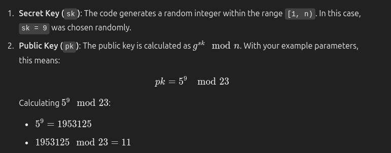

# public_key_cryptography

One the most basic examples of an application for DL-
secure groups is in public key cryptography, where the parties publicly agree on some pair
(G, g) such that G is a finite cyclic group of appropriate order n, believed to be a DL-secure
group, and g is a generator of G.
In this setting, a secret key is some number sk ∈ Zr and the associated public key pk is the
group element pk = g^sk . Since discrete logarithms are assumed to be hard, it is infeasible for an
attacker to compute the secret key from the public key, as this would involve finding solutions
x to the following equation (which is believed to be infeasible):
pk = g^x

In this concept, we use the modular exponentiation function to calculate the public key based on the secret key.

